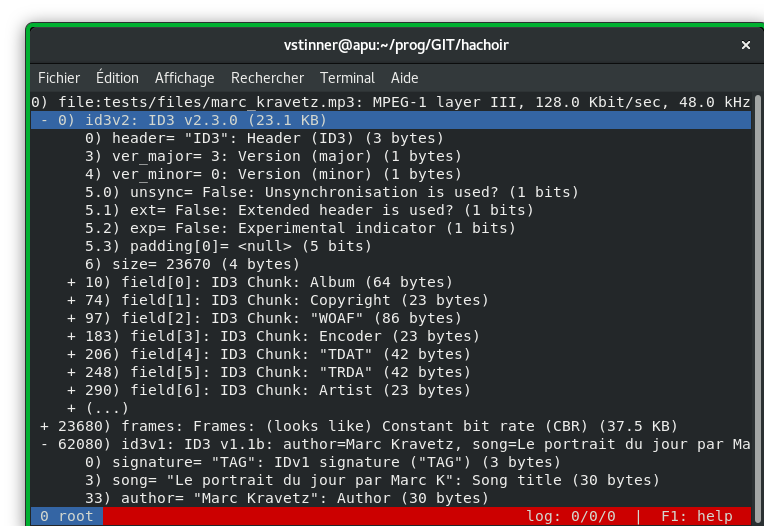

.. _urwid:

+++++++++++++++++++++
hachoir-urwid program
+++++++++++++++++++++

hachoir-urwid is a binary file explorer based on Hachoir library to parse the
files. Using this tool you can exactly know the meaning of each bit/byte of
your files. With direction keys, you can navigate in the field tree. The key
'h' will disable 'human display' and switch to 'raw display'. It's sometime
useful when you would like to compare hexadecimal data and Hachoir
reprensentation.

**hachoir-urwid** is the most user friendly interface based on Hachoir to
explore a binary file.

Before use, make sure to install the required dependencies with ``pip install
hachoir[urwid]``.

Command line options
====================

* ``--preload=10``: Load 10 fields when loading a new field set
* ``--path="/header/bpp"``: Open the specified path and focus on the field
* ``--parser=PARSERID``: Force a parser (and skip parser validation)

Usefull keys
============

Move:

* up/down: move up/down
* home: go to parent
* end: go to the last field of a field set
* left/right: horizontal scrolling

Setup display:

* h: most important option :-) switch between human display (default) and raw value
* v / d / s: show or hide field value / description / size
* a: switch between relative (default) and absolute address
* b: switch between address in decimal (default) and hexadecimal

Interaction:

* enter: on a field set, expand/collaspe the children
* space: parse a file/stream contained in the current field

Application:

* q: quit
* < / >: previous / next tab
* + / -: move separator vertically
* esc or CTRL+W: close current tab
* F1: display help

Help
====

Command line options: use --help option.

In hachoir-use, use F1 key to get help (keyboard keys).
