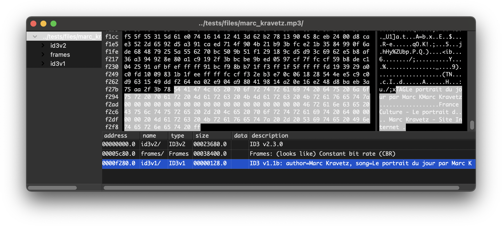

.. _wx:

++++++++++++++++++
hachoir-wx program
++++++++++++++++++

hachoir-wx is a graphical binary file explorer and hex viewer, which uses the
Hachoir library to parse the files and the WxPython library to create the user
interface.

Before use, make sure to install the required dependencies with ``pip install
hachoir[wx]``. On Mac OS and Windows, this will install WxPython. On Linux, you
may need to install a version of WxPython using your distribution's package manager
or from the `WxPython Download page <https://www.wxpython.org/pages/downloads/>`_.

Command line options
====================

* ``--preload=10``: Load 10 fields when loading a new field set
* ``--path="/header/bpp"``: Open the specified path and focus on the field
* ``--parser=PARSERID``: Force a parser (and skip parser validation)
* ``--help``: Show all command line options
